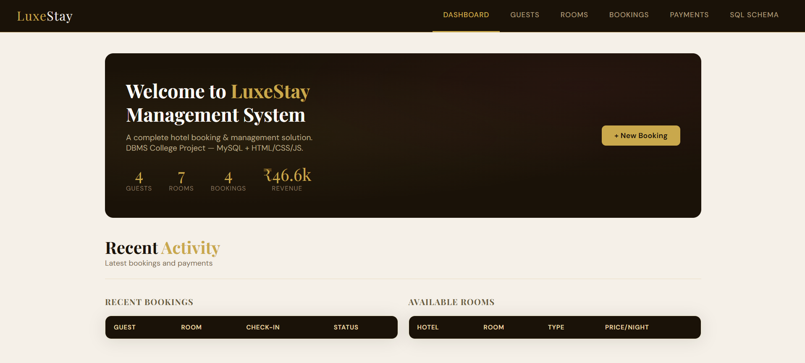
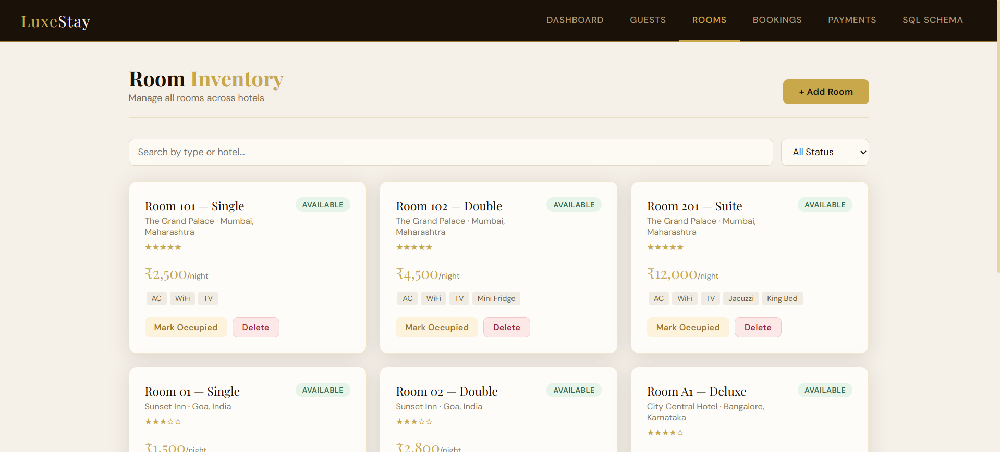
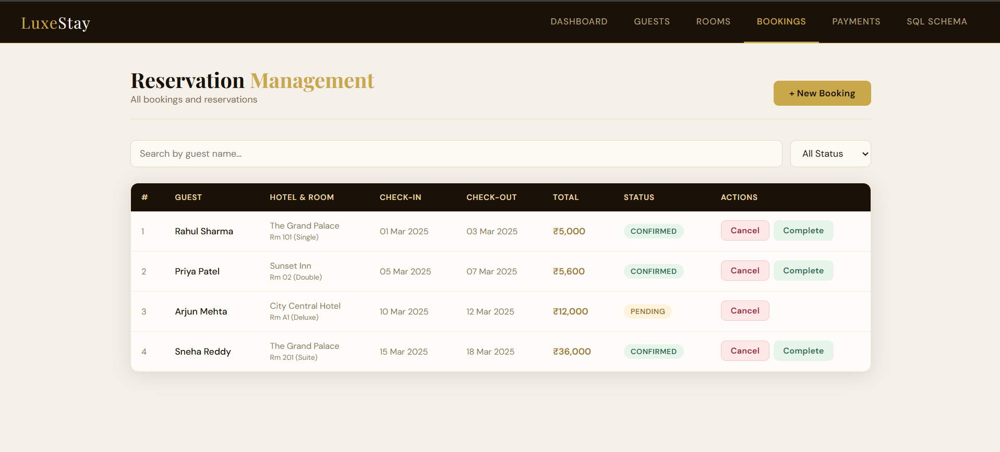
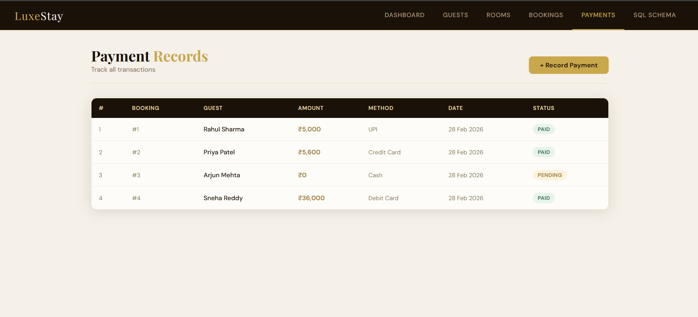

##LuxeStay — Hotel Booking & Management System

> A full-stack hotel booking and management system built for a college DBMS project using **MySQL**, **Node.js**, **Express**, and **vanilla HTML/CSS/JS**.

---

##Website UI

### Dashboard


### Rooms


### Bookings


### Payments


---

## 📋 Table of Contents

- [Features](#-features)
- [Tech Stack](#-tech-stack)
- [Database Schema](#-database-schema)
- [Project Structure](#-project-structure)
- [Getting Started](#-getting-started)
- [API Endpoints](#-api-endpoints)
- [How to Use](#-how-to-use)

---

## ✨ Features

- **Dashboard** — Live stats for guests, rooms, bookings and revenue
- **Guest Management** — Add, search and delete guests
- **Room Inventory** — Manage rooms across multiple hotels with status tracking
- **Booking System** — Create reservations with automatic price calculation
- **Payment Tracking** — Record and monitor all transactions
- **SQL Schema Viewer** — View ER relationships and key queries inside the app

---

## 🛠 Tech Stack

| Layer | Technology |
|-------|-----------|
| Frontend | HTML, CSS, JavaScript |
| Backend | Node.js, Express.js |
| Database | MySQL |
| Tools | MySQL Workbench, VS Code |

---

## 🗄 Database Schema

The system uses 5 interconnected tables:

```
Guest ──────────────┐
                    ▼
Hotel ──► Room ──► Booking ──► Payment
```

| Table | Primary Key | Description |
|-------|-------------|-------------|
| Guest | guest_id | Stores customer information |
| Hotel | hotel_id | Hotel property details |
| Room | room_id | Room inventory per hotel |
| Booking | booking_id | Reservation records |
| Payment | payment_id | Transaction records |

**Relationships:**
- `Room` → `Hotel` via `hotel_id` (FK)
- `Booking` → `Guest` via `guest_id` (FK)
- `Booking` → `Room` via `room_id` (FK)
- `Payment` → `Booking` via `booking_id` (FK)

---

## 📁 Project Structure

```
hotel-backend/
├── hotel_booking.html    # Frontend UI
├── server.js             # Express backend + API routes
├── hotel_schema.sql      # MySQL database schema + sample data
├── .env                  # Environment variables (not pushed to GitHub)
├── .gitignore
├── package.json
├── node_modules/
└── screenshots/          # Add your screenshots here
    ├── dashboard.png
    ├── rooms.png
    ├── bookings.png
    └── payments.png
```

---

## 🚀 Getting Started

### Prerequisites

- [Node.js](https://nodejs.org) installed
- [MySQL](https://dev.mysql.com/downloads/mysql/) installed
- [MySQL Workbench](https://dev.mysql.com/downloads/workbench/) (optional, for GUI)

### 1. Clone the Repository

```bash
git clone https://github.com/your-username/hotel-backend.git
cd hotel-backend
```

### 2. Install Dependencies

```bash
npm install
```

### 3. Set Up the Database

Open MySQL Workbench and import the schema:

- Go to **Server → Data Import**
- Select **Import from Self-Contained File**
- Choose `hotel_schema.sql`
- Set target schema to `hotel_booking_db`
- Click **Start Import**

### 4. Configure Environment Variables

Create a `.env` file in the root folder:

```env
PORT=3000
DB_HOST=localhost
DB_USER=root
DB_PASSWORD=your_mysql_password
DB_NAME=hotel_booking_db
```

### 5. Start the Server

```bash
node server.js
```

You should see:

```
✅ Connected to MySQL!
🏨 Hotel server running at http://localhost:3000
```

### 6. Open the App

Go to your browser and visit:

```
http://localhost:3000/hotel_booking.html
```

---

## 📡 API Endpoints

### Guests

| Method | Endpoint | Description |
|--------|----------|-------------|
| GET | `/api/guests` | Get all guests |
| POST | `/api/guests` | Add a new guest |
| DELETE | `/api/guests/:id` | Delete a guest |

### Rooms

| Method | Endpoint | Description |
|--------|----------|-------------|
| GET | `/api/rooms` | Get all rooms |
| POST | `/api/rooms` | Add a new room |
| PATCH | `/api/rooms/:id/status` | Update room status |
| DELETE | `/api/rooms/:id` | Delete a room |

### Bookings

| Method | Endpoint | Description |
|--------|----------|-------------|
| GET | `/api/bookings` | Get all bookings |
| POST | `/api/bookings` | Create a new booking |
| PATCH | `/api/bookings/:id/cancel` | Cancel a booking |
| PATCH | `/api/bookings/:id/complete` | Complete a booking |

### Payments

| Method | Endpoint | Description |
|--------|----------|-------------|
| GET | `/api/payments` | Get all payments |
| POST | `/api/payments` | Record a payment |

---
##Developer

**Carol Lauren Menezes**  
DBMS Project — 2026